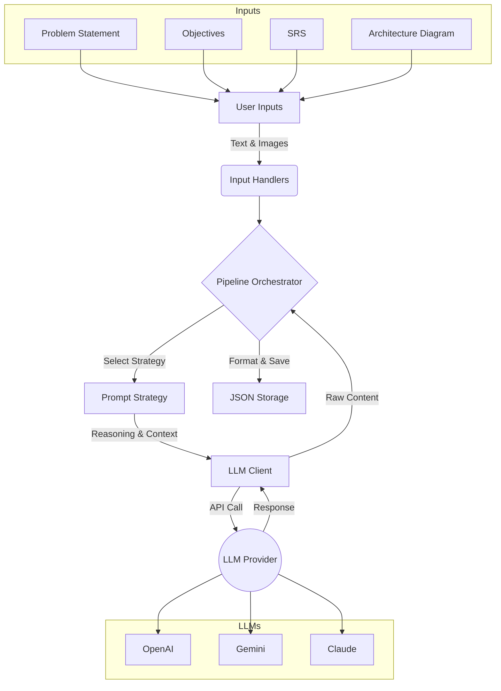

# BE Project Critique Pipeline

A Python tool for generating LLM-powered critiques of Bachelor of Engineering (BE) project papers.

## Installation

1.  **Clone the repository:**
    ```bash
    git clone <repository_url>
    cd Library_Project
    ```

2.  **Create and activate a virtual environment:**
    ```bash
    python3 -m venv venv
    source venv/bin/activate  # On Windows: venv\Scripts\activate
    ```

3.  **Install dependencies:**
    ```bash
    pip install -r requirements.txt
    ```

4.  **Configure API Keys:**
    Copy `.env.sample` to `.env` and add your API keys:
    ```bash
    cp .env.sample .env
    ```
    Edit `.env`:
    ```env
    OPENAI_API_KEY=your_key
    GOOGLE_API_KEY=your_key
    ANTHROPIC_API_KEY=your_key
    ```

## Pipeline Architecture

The system follows a modular pipeline to generate critiques:



1.  **Inputs**: Accepts problem statement, objectives, SRS, and architecture images.
2.  **Processing**: Loads data using specialized handlers (e.g., converting images to Base64).
3.  **Strategy**: Applies the selected prompting technique (e.g., Chain-of-Thought, Expert Persona).
4.  **Generation**: Queries the configured LLM (OpenAI, Gemini, or Claude).
5.  **Output**: structured JSON containing the critique, metadata, and scores.

## Running the Code

Run the interactive menu:

```bash
python src/menu.py
```

Follow the on-screen instructions to:
1.  Select Critiques (Manual or from CSV)
2.  Choose an LLM (OpenAI, Gemini, Claude, or All)
3.  Choose a Prompting Technique

## Parameter Analysis Prompt Matrix

`ParameterAnalysisPipeline` now supports pair-wise prompts per `(criterion/parameter, prompting technique)`.

Detailed prompt writing guide:
- [PROMPT_AUTHORING_GUIDE.md](PROMPT_AUTHORING_GUIDE.md)

How it works:
1. The pipeline tries to load a prompt table from `parameters.xlsx` (or `PARAMETER_PROMPT_TABLE_PATH` in `.env`).
2. If no prompt table is found, it falls back to the old `parameters.csv` flow.
3. For each pair `(parameter, technique)`, it runs that pair's prompt.
4. If a prompt cell contains multiple prompts (for example CoT), the prompts are executed sequentially in chat order and the last step is treated as the final decision.

Supported table formats:

1. Wide format (recommended for quick authoring)

```text
criteria | monolithic | cot | expert | cove | rcot | two_model
```

2. Long format

```text
criterion | prompt_technique | prompt
```

Multi-step prompts in a single cell can be separated by:
- `||`
- a line with `---`
- a line with `===`
- labels like `Prompt 1:`, `Prompt 2:`, `Step 1:`, `Step 2:`

You can also provide a JSON list in one cell, for example:

```json
["collect evidence", "validate assumptions", "output final JSON"]
```

## Output Structure

Critiques are saved as JSON files in the `outputs/` directory.

**Naming Convention (CSV Mode):**
```
{group_id}_{prompt_technique}_{model}.json
```
*Example:* `group_1_expert_gpt-4o.json`

**Naming Convention (Manual Mode):**
```
{timestamp}_{llm}_{prompt_technique}.json
```

## Prompting Techniques

The system implements three core prompting strategies, each designed for specific analysis needs:

### 1. Expert
**Implementation**: This technique uses a specific "Expert Software Architect" persona with 20+ years of experience.
-   **Persona**: Adopts a critical, professional tone.
-   **Focus**: Specifically looks for inconsistencies, performance bottlenecks, redundancy, and clarity issues.
-   **Output**: Produces a structured critique with actionable architectural insights.

### 2. Chain-of-Thought
**Implementation**: Decomposes the critique generation into explicit reasoning steps.
-   **Step 1**: Analyze the Problem Statement & Objectives.
-   **Step 2**: Evaluate the Architecture Diagram against the requirements.
-   **Step 3**: Review the SRS for completeness and feasibility.
-   **Step 4**: Synthesize findings into a final critique.
-   **Benefit**: Reduces hallucinations and improves logical flow by forcing the model to "think" before writing.

### 3. Monolithic
**Implementation**: Sends all inputs (Architecture, Problem, Objectives, SRS) in a single, comprehensive prompt.
-   **Strategy**: "Here is all the project info; please critique it based on these criteria."
-   **Use Case**: Good for a quick, holistic overview or as a baseline to compare against more advanced techniques.

## Project Structure

```
Library_Project/
├── config/             # Settings and configuration
├── src/
│   ├── menu.py         # Main interactive menu
│   ├── pipeline.py     # Orchestrates the critique generation
│   ├── llm/            # LLM provider integrations
│   ├── prompts/        # Prompt strategies (CoT, etc.)
│   ├── input_handlers/ # CSV, Image, Text loaders
│   └── output/         # JSON storage logic
├── inputs/             # Place input files here (optional)
├── outputs/            # Generated critique files
└── requirements.txt    # Python dependencies
```
